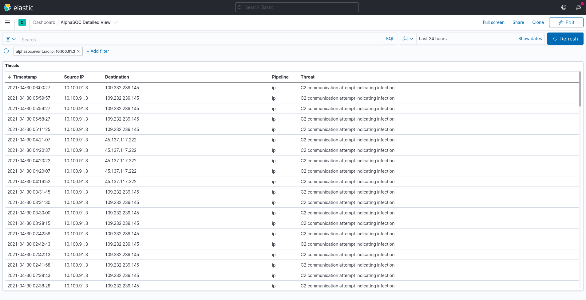

# alphasocbeat

Alphasocbeat is a beat for the elastic stack. Its purpose is to download alerts generated by AlphaSOC Analytics Engine and ship them to elasticsearch.

It also provides Kibana dashboards helpful in reviewing the alerts.

AlphaSOC Threat Hunter dashboard:


AlphaSOC Detailed View dashboard:


# Setup / Installation

## Binaries

The latest alphasocbeat release can be found [here](https://github.com/alphasoc/alphasocbeat/releases).

## Configuration

Configuration is stored in `alphasocbeat.yml` file. Beat specific configuration requires 3 values:
```
alphasocbeat:
  registry_file: checkpoint.yaml
  api_url: https://api.alphasoc.net
  api_key: <api_key>
```
`registry_file` is used to store `follow` value, which provides data continuation between beat restarts. It allows downloading alerts newer than last downloaded alert, to avoid data duplication.

`api_key` api key provided by AlphaSOC, allows downloading alerts from API.

## Index setup

To setup elastic index provided by alphasocbeat, run the following command:

```
./alphasocbeat setup
```

## Running alphasocbeat

To start alphasocbeat, run the following command:

```
./alphasocbeat run
```

# Logs

Alphasocbeat logs are stored in `./logs` directory.

# Dashboards 

By default dashboards are installed on running beat. Setting `setup.dashboards.enabled: false` disables that feature.
